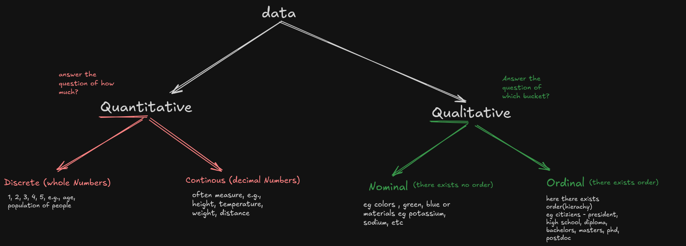
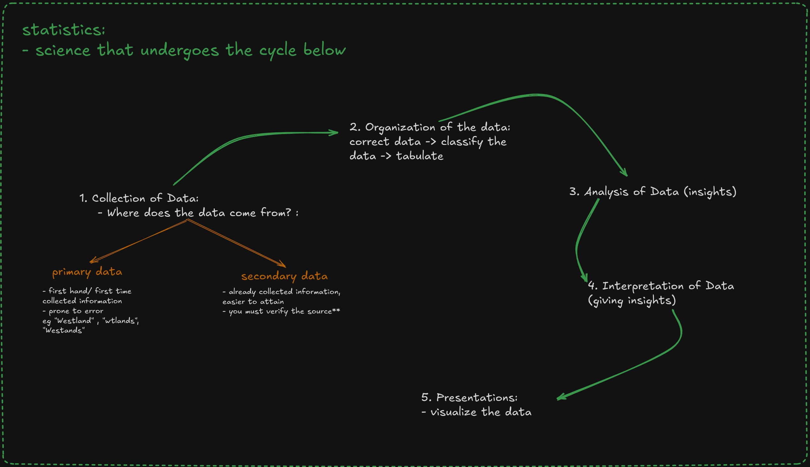
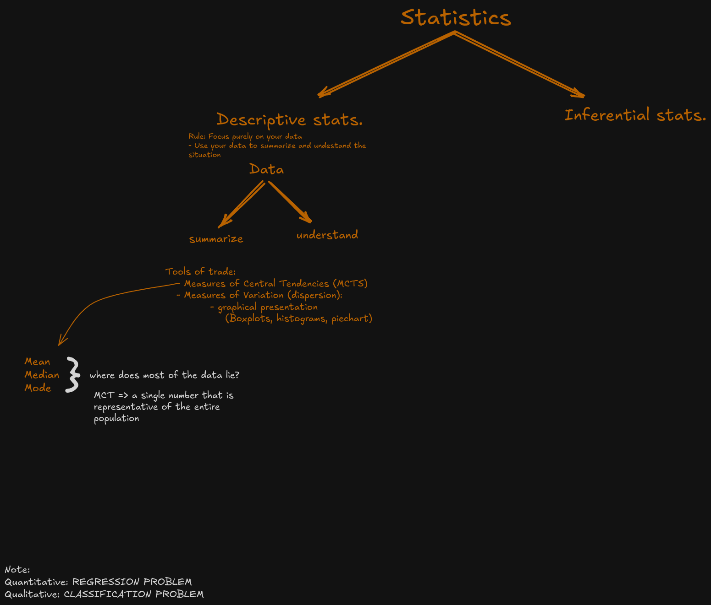

## **References:**
[Pandas Documentation](https://pandas.pydata.org/)

[Extra Learning resources](https://drive.google.com/drive/folders/1yKVSfVAAWDfwdwRgAWtJHzopoLKHrg1b?usp=sharing)

## **Core Methodology:**

